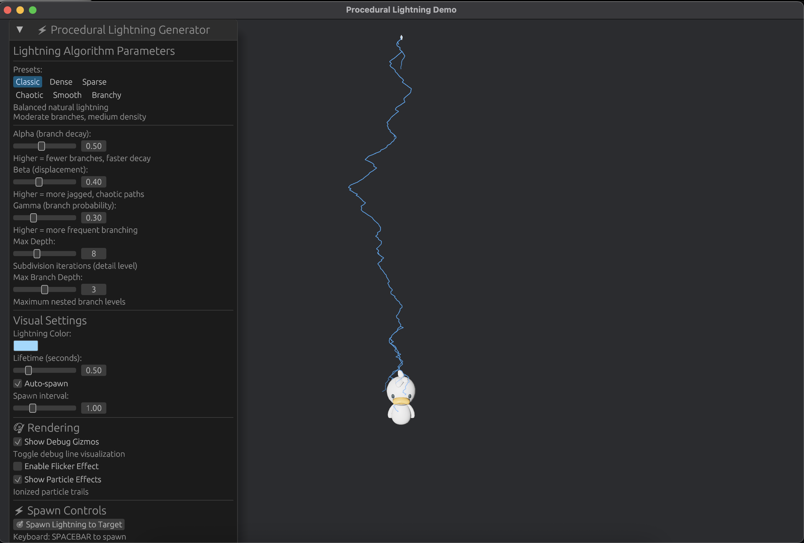

# Procedural Lightning VFX



A procedural lightning generation system for Bevy game engine, inspired by the [LightningGen](https://github.com/CXUtk/LightningGen) algorithm.

[](https://bevyengine.org/)


## Features

- **Recursive Subdivision Algorithm**: Generates realistic lightning bolts with natural-looking branching
- **Configurable Parameters**: Control branch probability, displacement, decay rates, and recursion depth
- **Energy Attenuation**: Physically-inspired energy distribution along branches
- **6 Built-in Presets**: Classic, Dense, Sparse, Chaotic, Smooth, and Branchy configurations
- **Deterministic Generation**: Same seed produces identical lightning patterns
- **Bevy Integration**: Full ECS architecture with Bevy 0.17 compatibility
- **Hanabi Particle Effects**: Traveling ionized particles with configurable visibility
- **Flicker Animation**: Customizable flicker speed with on/off intervals
- **Interactive Demo**: Real-time parameter tweaking with egui interface

> **Note**: The current particle effects are basic traveling particles. Future improvements could include more sophisticated visual effects such as electrical arcs, corona discharge, and dynamic branching particle streams.

## Demo

Run the interactive demo:

```bash
cargo run --example demo --release
```

### Controls

- **WASD / Arrow Keys**: Move the target duck
- **SPACEBAR**: Spawn lightning bolt to target
- **UI Panel**: Adjust algorithm parameters in real-time

## Algorithm

The lightning generation uses a recursive subdivision approach:

1. **Start with a line segment** from start position to end position
2. **Subdivide recursively**, adding random perpendicular displacement at each midpoint
3. **Spawn branches** with exponentially decaying probability
4. **Track energy density** from source to branches
5. **Render as line segments** or convert to particle effects

### Parameters

- **Alpha (α)**: Branch probability decay (0.3-0.6 typical)
  - Higher values = fewer branches, faster decay
  
- **Beta (β)**: Perpendicular displacement magnitude (0.2-0.6 typical)
  - Higher values = more jagged, chaotic paths
  
- **Gamma (γ)**: Base branch probability (0.2-0.6 typical)
  - Higher values = more frequent branching
  
- **Max Depth**: Subdivision recursion limit (4-15 typical)
  - Higher values = more detailed lightning
  
- **Max Branch Depth**: Maximum nested branch levels (0-6 typical)
  - Prevents infinite branching

## Usage

### Basic Example

```rust
use procedural_lightning::{
    LightningConfig, LightningTree, ProceduralLightningPlugin,
    spawn_procedural_lightning,
};
use bevy::prelude::*;
use bevy_hanabi::prelude::*;

fn main() {
    App::new()
        .add_plugins(DefaultPlugins)
        .add_plugins(HanabiPlugin)
        .add_plugins(ProceduralLightningPlugin)
        .add_systems(Startup, spawn_lightning)
        .run();
}

fn spawn_lightning(
    mut commands: Commands,
    mut effects: ResMut<Assets<EffectAsset>>,
) {
    let config = LightningConfig {
        seed: 42,
        alpha: 0.5,
        beta: 0.4,
        gamma: 0.3,
        max_depth: 8,
        max_branch_depth: 3,
    };

    let start = Vec3::new(0.0, 200.0, 0.0);  // Sky
    let end = Vec3::new(0.0, 0.0, 0.0);      // Ground

    spawn_procedural_lightning(
        &mut commands,
        &mut effects,
        start,
        end,
        &config,
        0.5,  // lifetime in seconds
        Color::srgb(0.3, 0.7, 1.0),  // electric blue
        true,  // show_gizmos
        true,  // show_particles
    );
}
```

### Using Presets

The demo includes 6 hand-tuned presets:

```rust
// Classic: Balanced natural lightning
let config = LightningConfig {
    alpha: 0.5, beta: 0.4, gamma: 0.3,
    max_depth: 8, max_branch_depth: 3,
    ..default()
};

// Dense: Heavy branching with many segments
let config = LightningConfig {
    alpha: 0.3, beta: 0.3, gamma: 0.5,
    max_depth: 10, max_branch_depth: 4,
    ..default()
};

// Chaotic: Wild, erratic paths
let config = LightningConfig {
    alpha: 0.4, beta: 0.6, gamma: 0.6,
    max_depth: 12, max_branch_depth: 5,
    ..default()
};
```

### Custom Rendering

Generate the tree and render manually:

```rust
use procedural_lightning::{LightningTree, LightningConfig};

let tree = LightningTree::generate(start, end, &config);

// Get all line positions
let positions = tree.get_line_positions();

// Sample particle positions
let particle_pos = tree.sample_particle_positions(64);

// Get energy-weighted data
let particle_data = tree.get_particle_data(128);
```

### Hanabi Particle Effects

The library includes basic traveling ionized particle effects. Particles can be toggled on/off and travel from the spawn point to the target:

```rust
// Spawn lightning with particles enabled
spawn_procedural_lightning(
    &mut commands,
    &mut effects,
    start,
    end,
    &config,
    0.5,
    color,
    true,  // show_gizmos
    true,  // show_particles (traveling ionized effect)
);
```

For more advanced effects, you can access the lightning tree directly and create custom particle systems.

## Technical Details

### Algorithm Background

Based on the fractal/recursive subdivision approach from:

- [LightningGen by CXUtk](https://github.com/CXUtk/LightningGen)
- "Fast Rendering of Lightning" (Reeves, 1985)
- Procedural generation techniques from computer graphics research

### Performance

- **Generation**: O(2^d) where d = max_depth (due to recursive subdivision)
- **Memory**: Linear in number of nodes (typically 100-2000 nodes)
- **Rendering**: Gizmos for debug, custom shaders or particles for production
- **Frame Time**: <0.1ms for generation, rendering depends on method

### Branch Direction Fix

All branches are constrained to move generally toward the target (downward for lightning strikes), preventing unrealistic backward branching. The algorithm blends perpendicular displacement (±0.6) with forward momentum (0.3-0.8).

## Dependencies

- **bevy**: 0.17.0 - Game engine
- **bevy_hanabi**: 0.17.0 - GPU particle effects (optional)
- **bevy_egui**: 0.38.1 - Demo UI (dev only)
- **rand**: 0.8.5 - Random number generation
- **rand_chacha**: 0.3.1 - Deterministic RNG

## License

Licensed under either:

- MIT License ([LICENSE-MIT](LICENSE-MIT) or <http://opensource.org/licenses/MIT>)
- Apache License, Version 2.0 ([LICENSE-APACHE](LICENSE-APACHE) or <http://www.apache.org/licenses/LICENSE-2.0>)

at your option.

## Credits

- Algorithm inspired by [LightningGen](https://github.com/CXUtk/LightningGen) by [CXUtk](https://github.com/CXUtk)
- Duck model from [KayKit Character Pack: Adventures](https://kaylousberg.itch.io/kaykit-adventurers) by [Kay Lousberg](https://kaylousberg.com/)
- Built with [Bevy](https://bevyengine.org/) game engine

## Contributing

Contributions welcome! Please open an issue or PR.

### Ideas for Improvement

- [ ] Enhanced particle effects (electrical arcs, corona discharge, branching streams)
- [ ] Custom shaders for HDR bloom effects
- [ ] Sound effects integration
- [ ] 2D lightning variant
- [ ] Multi-target forking (tree → multiple targets)
- [ ] Animated "growth" from source to target
- [ ] Collision detection with scene geometry
- [ ] Chain lightning between multiple objects
